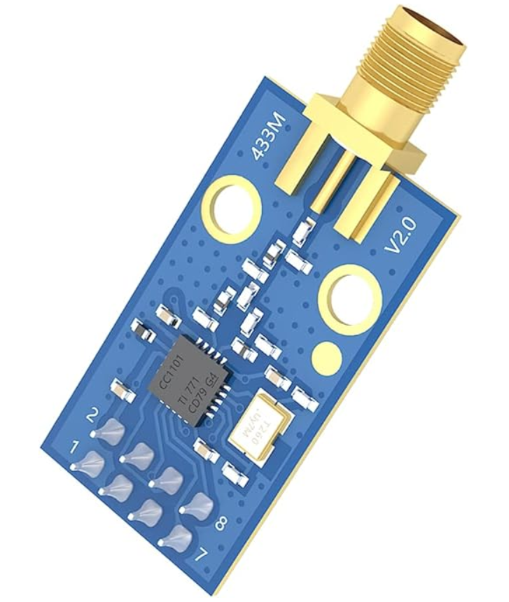

# CC1101_Shield_Wemos_D1_mini

This is the CC1101_v2 module's shield for the 'Wemos ESP8266 D1 mini' board. 

This design for the 'PCB shield' has been made following the wiring design from LSatan's library for the CC1101 10pin module 

https://github.com/LSatan/SmartRC-CC1101-Driver-Lib 

However, I did an adaptation to the CC1101_v2 module which is currently the most available version in the market (It has 8pins, blue and with two circle-holes).

The Shield PCB's print shows 'RFMOGGY' on it, which is an awesome Radio frequency' project that inspired the creation of this PCB shield.

https://github.com/gusgorman402/RFmoggy 

